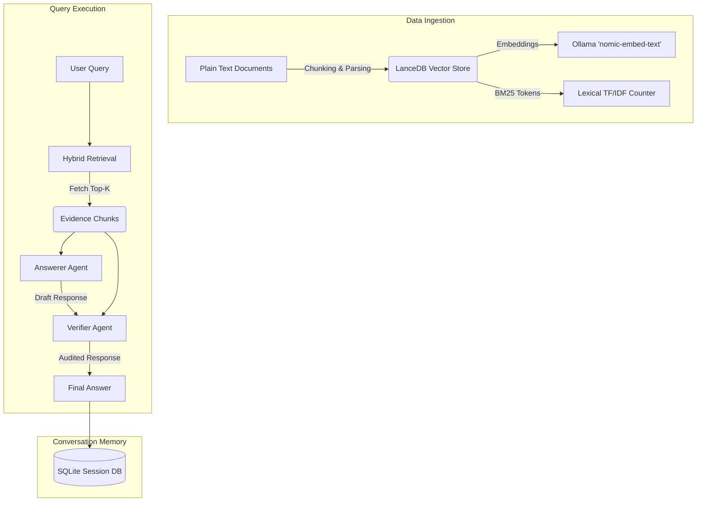

# KKEdu RAG: Enterprise Retrieval-Augmented Generation

> An on-premise, lightweight, and powerful Retrieval-Augmented Generation (RAG) system built to answer complex questions strictly from provided plain-text context without hallucination.

## Project Overview

KKEdu RAG is a robust, CLI and Web-based retrieval-augmented generation solution designed for enterprise use cases where accuracy, data privacy, and evidence-backing are paramount. As a fully on-premise and lightweight system powered by LanceDB, it ingests plain-text documents (like employee handbooks, contracts, or product catalogs) and provides a chat-based interface to query this custom knowledge base locally, ensuring zero data leakage. A core design philosophy of this project is **strict adherence to context**—it utilizes a dual-agent architecture (Answerer + Verifier) to ensure that the language model does not hallucinate facts, counts, or categories that are not explicitly present in the source materials.

## Features

- **Document-Agnostic Ingestion**: Seamlessly handles any unstructured or semi-structured plain text without requiring code modifications.
- **Intelligent Chunking**: Implements character-based chunking with overlap to preserve semantic context across boundaries.
- **Hybrid Retrieval (BM25 + Semantic)**: Fuses keyword scoring (BM25) with dense vector embeddings to ensure precise recall of exact IDs/names alongside semantic concepts.
- **Agentic Verification Pipeline**: A dedicated "Verifier" agent acts as a guardrail, auditing draft responses against raw evidence to prevent hallucinated data or dropped figures.
- **Persistent Memory**: Uses a SQLite-backed session layer to maintain conversational context across runs.
- **Real-Time Web UI**: Features an SSE (Server-Sent Events) powered Web UI for real-time token streaming and drag-and-drop document upload.

## Architecture

The system utilizes an inward-facing layered architecture with explicit boundaries between retrieval, LLM reasoning, and validation guards.



## Technology Stack

| Category | Technology | Purpose |
|----------|------------|---------|
| **Core Language** | Python 3.12+ | Base runtime for the system. |
| **Agent Framework** | OpenAI Agents Python SDK | Orchestration of Answerer and Verifier agents. |
| **LLM Inference** | Ollama | Local model hosting & inference engine. |
| **Chat Model** | `gpt-oss:20b-cloud` | Reasoning, drafting, and tool-calling model. |
| **Embedding Model** | `nomic-embed-text` | High-quality 768-dimensional text embeddings. |
| **Vector Database** | LanceDB | On-disk columnar vector store with native cosine similarity search. |
| **Lexical Search** | Python `collections.Counter` | Term Frequency calculation for BM25. |
| **Database** | SQLite (`rag_memory.db`) | Persistent conversation memory. |
| **Web Server** | FastAPI | High-performance async API and SSE streaming layer. |

## Chunking Strategy

Documents are split using a strict, character-based sliding window approach to balance contextual depth and API limits.

- **Chunk Size**: `1000 characters`
- **Overlap**: `200 characters`
- **Rationale**: 1000 characters typically encapsulate a complete thought, paragraph, or specific entity details without diluting the semantic meaning. The 200-character overlap prevents critical entities (like names or IDs spanning two chunks) from being severed, ensuring the embedding model captures the continuous context.

## Embedding Strategy

- **Model**: `nomic-embed-text`
- **Dimensions**: `768`
- **Rationale**: Nomic's embedding model is highly optimized for retrieval tasks. It uses explicit task prefixes (e.g., `search_document:` for indexing and `search_query:` for querying) which drastically improves asymmetric retrieval performance compared to symmetric generic embedding models.

## Vector Database Design

The project utilizes a **Hybrid Vector Store** powered by **LanceDB**:
- **Semantic Indexing**: Embeddings are stored in a LanceDB on-disk columnar table. Similarity search is performed natively using LanceDB's built-in cosine distance metric, eliminating the need for manual matrix operations.
- **Lexical Indexing**: Chunk token frequencies are maintained using Python's `collections.Counter`, alongside a Document Frequency (DF) counter for Inverse Document Frequency (IDF) scoring.
- **Idempotency**: Documents are tracked by source filename. Re-indexing a file uses LanceDB's SQL-style `DELETE` filter to remove prior document chunks cleanly, preventing duplicate weighting.

## Retrieval Workflow

1. **Query Processing**: The user's query is embedded using `nomic-embed-text` with the `search_query:` prefix.
2. **Dual-Scoring**:
   - *Semantic Score*: LanceDB retrieves the top 1000 candidates ranked by cosine similarity.
   - *Lexical Score*: BM25 scoring isolates exact keyword matches across all indexed chunks.
3. **Normalization & Fusion**: Both scores are normalized using Min-Max scaling to a `[0,1]` range and blended linearly (`Lexical Weight = 0.45`).
4. **Ranking**: The top `K=15` highest-scoring chunks are returned to the Answerer agent as formatted evidence.

## Hallucination Prevention

A hallmark of this RAG implementation is its strict non-hallucination guarantee:
1. **Instruction Formatting**: The Answerer agent is prompted to rely strictly on the provided evidence chunks.
2. **Verifier Agent Auditing**: The draft response is immediately routed to a second agent (the Verifier).
3. **Code Gates (`guards.py`)**: The Verifier checks the draft for numerical and categorical consistency. If the Answerer claims "5 robots exist" but only 3 are in the context, the Verifier rejects the draft.
4. **Fallback**: If the system cannot answer the question using the retrieved context, it explicitly states that the information is missing.

## Project Structure

```text
kkedu_rag/
├── runtime/      # Bootstrap side-effects (tracing, stdout wrappers)
├── core/         # Configuration, prompts, pure data sanitization
├── llm/          # Ollama shared AsyncOpenAI client singleton
├── retrieval/    # Hybrid indexing, BM25 logic, VectorStore (LanceDB)
├── verification/ # Schema parsing and validation gates against hallucination
├── agents/       # Definition of Answerer and Verifier agents
├── services/     # Ingestion pipelines and one-turn Q&A logic
├── memory/       # SQLite session management
├── cli/          # Interactive terminal loop
└── web/          # FastAPI app, SSE streaming, and static UI assets
```

## Installation

### Prerequisites
- Python 3.12 or newer.
- [Ollama](https://ollama.com) installed and running locally.

### Setup Steps
1. Pull the required models via Ollama:
   ```bash
   ollama pull gpt-oss:20b-cloud
   ollama pull nomic-embed-text
   ```
2. Clone the repository and navigate to the project directory.
3. Create and activate a virtual environment:
   ```bash
   python -m venv .venv
   source .venv/bin/activate  # On Windows: .venv\Scripts\activate
   ```
4. Install dependencies:
   ```bash
   pip install -r requirements.txt
   ```

## Usage

### Command Line Interface (CLI)
You can launch the CLI interactive loop by providing a source document:
```bash
python -m kkedu_rag velammal-dataset-1.txt
```
*To reset conversation history, type `reset`. To exit, type `exit`.*

### Web Interface
Start the FastAPI server for the web UI:
```bash
python -m kkedu_rag.web
```
Open `http://127.0.0.1:8000` in your browser. You can drag and drop documents directly into the UI.

## Sample Queries

1. *What is the founding year of the organization?*
2. *How many students, staff members, and institutions does the organization have?*
3. *Who are the Chairman and CEO of the organization?*
4. *What curriculum is followed by Edubba/Global Schools?*
5. *What are the IIT-JEE and NEET ranks achieved by the organization/students?*

## Retrieved Chunks

**Example Chunk retrieved for Query 1:**
```text
[1] source=velammal-dataset-1.txt :: Velammal New Gen Edu Network (relevance 0.957; semantic 0.797, keyword 5.231)
=== DOCUMENT START ===
title: Velammal New Gen Edu Network
url: https://velammal.org/
category: homepage_overview

text:
Journey So Far
VELAMMAL GROUP
We started with a small school, few students, one Velammal Educational Trust and a dedicated set of teachers back in 1986. Today we are an educational edifice with lakhs of students, hundreds of teachers and several top-notch institutions growing under our umbrella. Our institutional breadth spans from Kindergarten (KG) to Post-Graduate levels...
=== DOCUMENT END ===
```

## Sample Answers

**Answer to Query 1:**
> The Velammal New Gen Edu Network was founded in 1986.

*(Notice how the answer is restricted completely to the provided chunk without extrapolating).*

## Limitations

- **Single-Turn Embedding Batching**: Currently, bulk ingesting extremely large files blocks the event loop momentarily while `EMBED_BATCH` constraints parse chunks.
